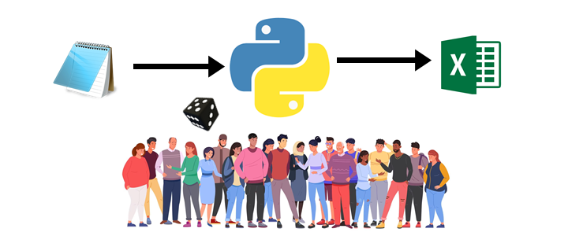

<h1 align="center"> FelipedelosH </h1>
 
<h4>FAKE Data of PEOPLE v1.0</h4>

 
:construction: IN CONSTRUCTION :construction:
  
read a .txt input files with person info, and randomized output.
This aplication generate a data from persons: ID, sex, names, lastnames, YYYY-MM-DD

## :hammer:Funcionalidades del proyecto
- `Function 1`: Export information to sql insert query. 
- `Function 2`: Export information to xlsx. 
- `Function 3`: Export information to Json formated. 
- `Function 4`: Export information to csv. 

## :play_or_pause_button:How to execute a project

Double click in main.py open tkinter window

General funtion>

1 - exist a folder called "dataset" and containts this .txt with sample information
 
	dbLASTNAME : contains all last name separate for line break.
	dbNAMEMALE : contains all names for men.
	dbNAMEFEMALE : contains al names for women.
  
2 - generalArchitecture
 
	this program reads .txt files and generate random names and values
	this program its able to generate sql, excel, .csv, .json file

## :hammer_and_wrench:Tecnologías.

- python
- tkinter

## :warning:Advertencia

- to change a sql setting touch code in file PersonModel method getSQLInsert()

## Autor

| [ Andrés Felipe Hernánez](https://github.com/felipedelosh)|
| :---: |
